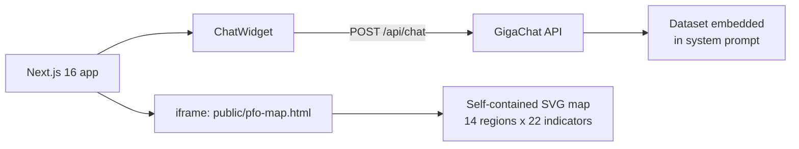
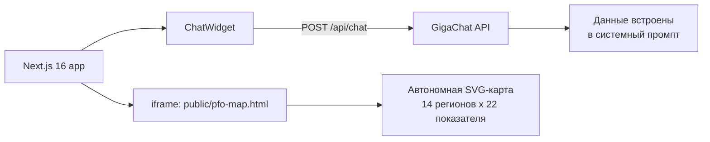

# Light Industry of the Volga Federal District — Interactive Map

**An interactive data-visualization case: the state of the light industry across the 14 regions of Russia's Volga Federal District (PFO), built as a self-contained SVG choropleth map with an AI chat assistant.**


---

## Overview

This repository is a research / data-visualization case around the light industry (textiles, clothing, leather and footwear) of the Volga Federal District. It packages a full-screen interactive SVG map of all **14 PFO regions** with **22 selectable indicators**, plus an AI chat assistant that answers questions about the embedded dataset.

The map itself is a single self-contained HTML file (`public/pfo-map.html`) — no external data or backend is required to render it. The Next.js application serves it full-screen and adds the chat widget on top.

## Problem

Regional statistics on light industry are scattered across tables and reports: employment, shipments, productivity, specialization and per-capita output for 14 regions — each in its own format, with no single view that lets you compare regions at a glance. Understanding "who leads in what" (and by how much) requires assembling and reconciling the data manually.

## Solution

A single interactive map that puts all of it in one place:

- **14 regions** of the PFO, each drawn as an SVG region on a choropleth map.
- **22 indicators** in 6 groups: employment (2024), shipments (2024), shipments (2025), productivity, specialization, per-capita production.
- Click any region to open a full **region detail card**; switch indicators to re-color the map instantly.
- An **AI chat assistant** (floating widget) answers questions in Russian about the dataset — employment, shipments, productivity, specialization, and region rankings.

## Key capabilities

| Capability | What it does |
|---|---|
| **Interactive SVG choropleth map** | All 14 PFO regions rendered as SVG paths; hover tooltips, click-to-select, green gradient color scale per indicator; rank indicators get a 1→14 rank color scale. |
| **22 indicators, 6 groups** | Employment (total, textile, clothing, leather, regional share, PFO share), Shipments 2024 (total + sub-industries, shares), Shipments 2025, Productivity (value + rank), Specialization coefficient K (+ rank), Per-capita production (+ rank). |
| **Region detail card** | Click a region → full breakdown: employment, shipments 2024/2025 by sub-industry, productivity, specialization coefficient, per-capita output, ranks (top-3 highlighted). |
| **Per-indicator statistics** | Average, maximum and minimum across the 14 regions with the region names, for the active indicator. |
| **Legend + scale bar** | Dynamic legend for the current color scale; cartographic scale bar computed for the map projection. |
| **PNG export** | One-click export of the current map view as an image. |
| **AI chat assistant** | Floating widget that answers dataset questions via the Next.js `/api/chat` route (GigaChat) with the 14-region dataset embedded as assistant context. |

## Architecture



- `src/app/page.tsx` — full-screen iframe of the map + floating chat widget.
- `public/pfo-map.html` — the canonical, self-contained map (data, geometry, rendering and export logic in one file).
- `src/app/api/chat/route.ts` — proxy to the GigaChat API with the dataset as assistant context (token caching, one retry on 401).
- `src/components/ChatWidget.tsx` — floating chat UI.
- `download/` — source data and generation helper scripts.

## Tech stack

- **Next.js 16** (App Router), **React 19**, **TypeScript 5**
- **Tailwind CSS 4** + **shadcn/ui** (Radix UI primitives)
- **Bun** (lockfile and production start script)
- **SVG** — the map is hand-built SVG with a conical equidistant projection
- Supporting deps: framer-motion, lucide-react, react-markdown, next-intl

## Project status

**Experiment / research case.** A delivered, working archive build: the map renders fully and the chat route is functional, but the data is a static snapshot and the project is not positioned as a maintained product.

## My contribution

- Designed and implemented the interactive SVG choropleth map as a self-contained HTML application: region geometry, projection, color scales, tooltip/legend/scale bar, and PNG export.
- Processed the regional statistics into a unified dataset — **14 regions × 22 indicators** — and computed the derived metrics: productivity per employee, specialization coefficient K, per-capita production, PFO/RF shares, and rankings.
- Built the region detail panel and the per-indicator statistics (average/min/max with region names).
- Developed the AI chat assistant integration (Next.js API route → GigaChat) with the dataset embedded as assistant context.
- Wrapped the map in a Next.js application for serving.

## Quick start

Requires [Bun](https://bun.sh) (recommended; the repo ships `bun.lock`) or Node.js + npm.

```bash
bun install
bun run dev      # http://localhost:3000
```

Production build (Next.js standalone):

```bash
bun run build
bun run start
```

## Configuration

- The map itself needs **no environment variables** — it is a static asset.
- The chat assistant calls the GigaChat API. **Note:** the API credentials are currently embedded directly in `src/app/api/chat/route.ts`; they should be moved to environment variables before any production use.
- Prisma (`prisma/schema.prisma`, `src/lib/db.ts`) is an unused scaffold in this project and is not required to run the app.

## Limitations

- **Static data snapshot**: employment (2024) and shipments (2024–2025) are embedded in the map; they are not refreshed from external sources.
- **Chat is context-based, not retrieval-based**: the assistant works from the dataset embedded in its system prompt (no vector search / RAG); answers outside the embedded data may be unreliable.
- **Hardcoded credentials**: GigaChat auth key is committed in the API route — move to env vars (see Configuration).
- **Simplified cartography**: the map uses a simplified projection suitable for analysis, not precise geography.
- **Russian-only UI**; no public demo URL is configured in the repository.

---

# Лёгкая промышленность ПФО — интерактивная карта

**Исследовательский data-visualization кейс: состояние лёгкой промышленности в 14 регионах Приволжского федерального округа, реализованный как автономная SVG-хороплет-карта с ИИ-ассистентом.**


---

## Обзор

Репозиторий — исследовательский / data-visualization кейс по лёгкой промышленности (текстиль, одежда, кожа и обувь) Приволжского федерального округа. Здесь упакована полноэкранная интерактивная SVG-карта всех **14 регионов ПФО** с **22 выбираемыми показателями**, плюс ИИ-ассистент, отвечающий на вопросы по встроенному набору данных.

Сама карта — один самодостаточный HTML-файл (`public/pfo-map.html`): для отрисовки не нужны внешние данные или бэкенд. Next.js-приложение выводит её на весь экран и добавляет поверх виджет чата.

## Проблема

Региональная статистика по лёгкой промышленности разбросана по таблицам и отчётам: занятость, отгрузка, производительность, специализация и подушевое производство по 14 регионам — каждое в своём формате, без единого представления, позволяющего сравнить регионы с первого взгляда. Чтобы понять, кто лидирует и в чём, данные приходится собирать и сводить вручную.

## Решение

Одна интерактивная карта, где всё собрано вместе:

- **14 регионов** ПФО, каждый отрисован как SVG-область на хороплет-карте.
- **22 показателя** в 6 группах: занятость (2024), отгрузка (2024), отгрузка (2025), производительность, специализация, подушевое производство.
- Клик по региону открывает полную **карточку региона**; переключение показателя мгновенно перекрашивает карту.
- **ИИ-ассистент** (плавающий виджет) отвечает на русском языке по данным набора — занятость, отгрузка, производительность, специализация и рейтинги регионов.

## Возможности

| Возможность | Что делает |
|---|---|
| **Интерактивная SVG-хороплет-карта** | Все 14 регионов ПФО как SVG-пути; тултипы при наведении, клик для выбора, зелёный градиент для значений; для рангов — шкала 1→14. |
| **22 показателя, 6 групп** | Занятость (итого, текстиль, одежда, кожа, доля в регионе, доля в ПФО), Отгрузка 2024 (итого + подотрасли, доли), Отгрузка 2025, Производительность (значение + ранг), Коэффициент специализации K (+ ранг), Подушевое производство (+ ранг). |
| **Карточка региона** | Клик по региону → полная разбивка: занятость, отгрузка 2024/2025 по подотраслям, производительность, коэффициент специализации, подушевое производство, ранги (топ-3 подсвечены). |
| **Статистика по показателю** | Среднее, максимум и минимум по 14 регионам с указанием регионов для активного показателя. |
| **Легенда + масштабная линейка** | Динамическая легенда под текущую цветовую шкалу; картографическая линейка, рассчитанная под проекцию карты. |
| **Экспорт PNG** | Экспорт текущего вида карты в изображение одной кнопкой. |
| **ИИ-ассистент** | Плавающий виджет, отвечающий по данным через маршрут Next.js `/api/chat` (GigaChat) с набором по 14 регионам, встроенным в контекст ассистента. |

## Архитектура



- `src/app/page.tsx` — полноэкранный iframe карты + плавающий виджет чата.
- `public/pfo-map.html` — каноническая самодостаточная карта (данные, геометрия, отрисовка и экспорт — в одном файле).
- `src/app/api/chat/route.ts` — прокси к GigaChat API с данными в контексте ассистента (кэш токена, один повтор при 401).
- `src/components/ChatWidget.tsx` — UI плавающего чата.
- `download/` — исходные данные и вспомогательные скрипты генерации.

## Технологии

- **Next.js 16** (App Router), **React 19**, **TypeScript 5**
- **Tailwind CSS 4** + **shadcn/ui** (примитивы Radix UI)
- **Bun** (lockfile и продакшн-скрипт запуска)
- **SVG** — карта свёрстана вручную, коническая равнопромежуточная проекция
- Дополнительно: framer-motion, lucide-react, react-markdown, next-intl

## Статус проекта

**Эксперимент / исследовательский кейс.** Рабочая архивная сборка: карта полностью рендерится, чат-маршрут функционален, но данные — статический снимок, и проект не позиционируется как поддерживаемый продукт.

## Мой вклад

- Спроектировал и реализовал интерактивную SVG-хороплет-карту как самодостаточное HTML-приложение: геометрия регионов, проекция, цветовые шкалы, тултип/легенда/масштабная линейка, экспорт в PNG.
- Обработал региональную статистику в единый набор данных — **14 регионов × 22 показателя** — и рассчитал производные метрики: производительность на сотрудника, коэффициент специализации K, подушевое производство, доли в ПФО/РФ и ранги.
- Построил панель деталей региона и статистику по показателям (среднее/максимум/минимум с названиями регионов).
- Разработал интеграцию ИИ-ассистента (маршрут Next.js → GigaChat) с набором данных в контексте.
- Упаковал карту в Next.js-приложение для раздачи.

## Быстрый старт

Требуется [Bun](https://bun.sh) (рекомендуется; в репозитории `bun.lock`) или Node.js + npm.

```bash
bun install
bun run dev      # http://localhost:3000
```

Продакшн-сборка (standalone Next.js):

```bash
bun run build
bun run start
```

## Конфигурация

- Для самой карты **переменные окружения не нужны** — это статический ассет.
- Чат-ассистент обращается к GigaChat API. **Важно:** учётные данные API сейчас захардкожены в `src/app/api/chat/route.ts`; перед продакшн-использованием их нужно вынести в переменные окружения.
- Prisma (`prisma/schema.prisma`, `src/lib/db.ts`) — неиспользуемый каркас в этом проекте, для запуска приложения не требуется.

## Ограничения

- **Статический снимок данных**: занятость (2024) и отгрузка (2024–2025) встроены в карту и не обновляются из внешних источников.
- **Чат на основе контекста, а не retrieval**: ассистент работает с данными, встроенными в системный промпт (без векторного поиска / RAG); ответы за пределами встроенных данных могут быть недостоверны.
- **Захардкоженные учётные данные**: ключ GigaChat закоммичен в маршрут API — вынести в env (см. Конфигурация).
- **Упрощённая картография**: карта использует упрощённую проекцию, пригодную для анализа, но не для точной геометрии.
- **Интерфейс только на русском**; публичный demo-URL в репозитории не настроен.
